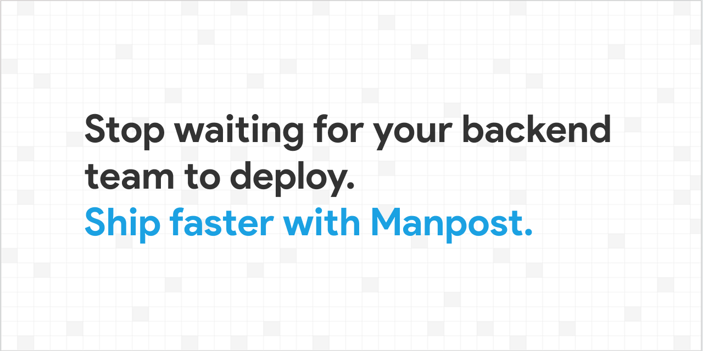
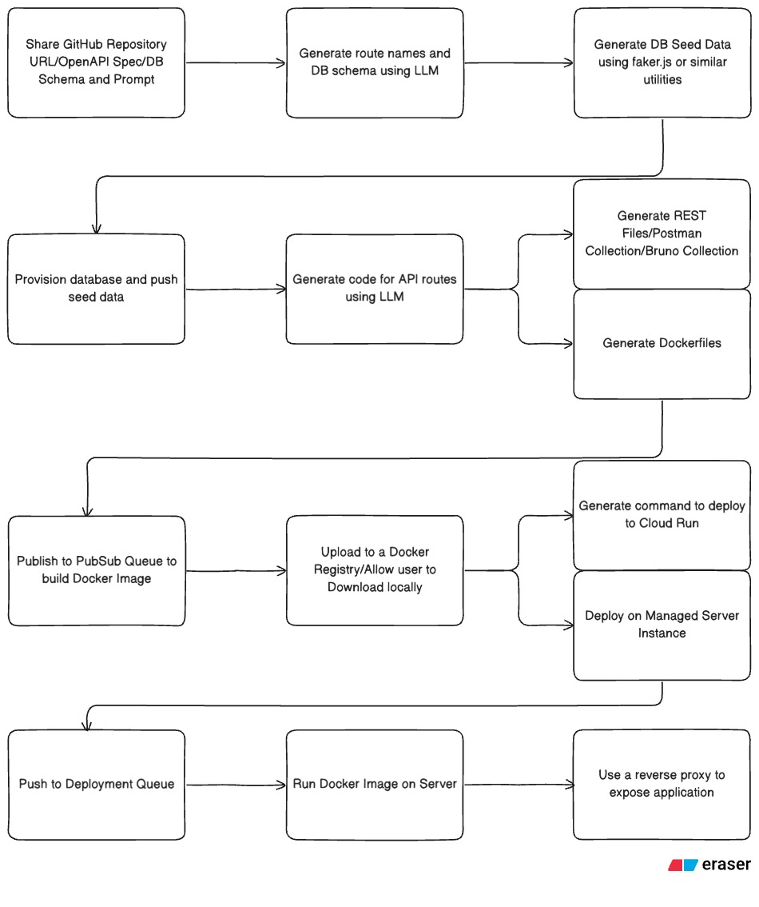

# GCCD Code the Cloud



## Description

GCCD Code the Cloud is a full-stack application designed to streamline the process of generating code, managing projects, and integrating with GitHub and OpenAPI specifications. It provides a user-friendly interface for developers to quickly scaffold projects, define schemas, and manage API endpoints.

## Features

- **Project Scaffolding:** Quickly generate new projects with predefined structures.
- **Schema Generation:** Define and generate database schemas.
- **Code Generation:** Automatically generate boilerplate code based on defined schemas and project requirements.
- **GitHub Integration:** Import projects from GitHub and manage repositories.
- **OpenAPI Integration:** Import and manage OpenAPI specifications.
- **API Endpoint Management:** Define and test REST API endpoints.

## Tech Stack

### Backend

- **Node.js:** JavaScript runtime environment.
- **Express.js:** Web application framework for Node.js.
- **Prisma:** Next-generation ORM for Node.js and TypeScript.
- **Docker:** Containerization of platform as well as Generated Mock API.
- **Self Hosted Docker Image Registry:** For storing and managing Docker images.

### Frontend

- **Next.js:** React framework for server-side rendering and static site generation.
- **React:** JavaScript library for building user interfaces.
- **Tailwind CSS:** Utility-first CSS framework.
- **Shadcn UI:** Collection of reusable, accessible UI components built with Tailwind CSS and Radix UI.

### Database

- **PostgreSQL:** Database for storing application data.


## Architecture


## Getting Started

### Prerequisites

- Node.js (latest LTS version recommended)
- pnpm (or npm/yarn)
- Docker Desktop (or Docker Engine)
- A compatible database server if not using Docker for the database.

### Installation

1.  **Clone the repository:**

    ```bash
    git clone https://github.com/MananGandhi1810/code-the-cloud-2025
    cd code-the-cloud-2025
    ```

2.  **Install backend dependencies:**

    ```bash
    cd backend
    pnpm install
    ```

3.  **Install frontend dependencies:**

    ```bash
    cd ../frontend
    pnpm install
    ```

4.  **Set up environment variables:**

    - Create a `.env` file in the `backend` directory based on a potential `.env.example` (if provided) or configure necessary variables for database connection, JWT secrets, GitHub API keys, etc.

5.  **Initialize the database (using Prisma):**
    ```bash
    cd ../backend
    pnpm prisma migrate dev
    ```

### Running the Application

1.  **Using Docker Compose (Recommended for combined frontend/backend):**

    - Ensure Docker is running.
    - From the project root directory:
      ```bash
      docker-compose up -d --build
      ```
    - The application should be accessible at `http://localhost:3000` (frontend) and the backend API at `http://localhost:8000` (or as configured in `docker-compose.yml`).

2.  **Running Backend and Frontend Separately:**

    - **Start the backend server:**

      ```bash
      cd backend
      pnpm start
      ```

      The backend will typically run on `http://localhost:8080`.

    - **Start the frontend development server:**
      ```bash
      cd ../frontend
      pnpm dev
      ```
      The frontend will typically run on `http://localhost:3000`.

## Project Structure

The project is organized into two main directories:

- `backend/`: Contains the Node.js/Express.js application, including API routes, handlers, middlewares, Prisma schema, and Docker configuration for the backend.
  - `prisma/`: Database schema and migrations.
  - `handlers/`: Request handlers for different routes.
  - `router/`: API route definitions.
  - `utils/`: Utility functions and integrations (GitHub, Docker, etc.).
  - `workers/`: Background task processors.
- `frontend/`: Contains the Next.js application, including pages, components, and static assets.
  - `app/`: Next.js App Router structure, defining pages and layouts.
  - `components/`: Reusable React components.
  - `lib/`: Utility functions for the frontend.

## API Endpoints

The backend exposes RESTful APIs for managing projects, authentication, schemas, etc.
You can find and test these endpoints using the `.rest` files located in the `backend/rest-api/` directory with a compatible REST client (e.g., VS Code REST Client extension).

- `backend/rest-api/auth.rest`
- `backend/rest-api/project.rest`

## Contributing

Contributions are welcome! Please follow these steps:

1.  Fork the repository.
2.  Create a new branch (`git checkout -b feature/your-feature-name`).
3.  Make your changes.
4.  Commit your changes (`git commit -m 'Add some feature'`).
5.  Push to the branch (`git push origin feature/your-feature-name`).
6.  Open a Pull Request.

Please ensure your code adheres to the existing coding style and all tests pass.

## License

(Specify your license here, e.g., MIT License. If no license is chosen, you can state "All Rights Reserved" or remove this section.)

---

_This README was auto-generated and can be further customized._
